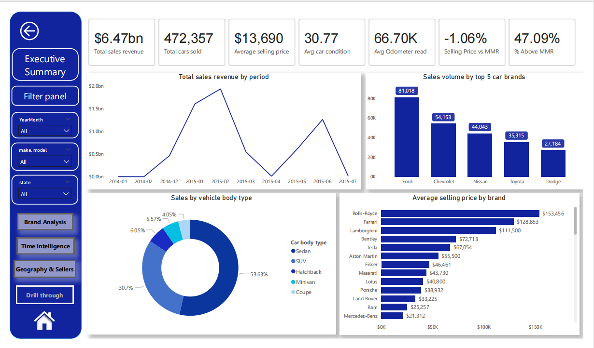
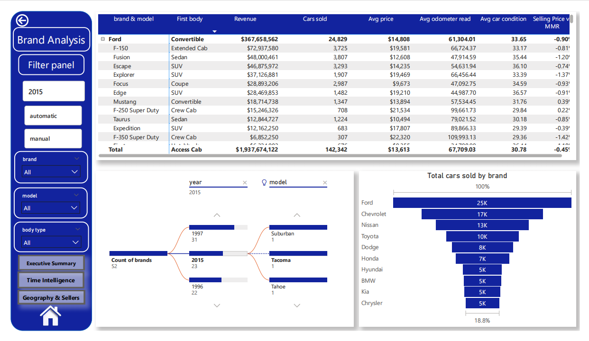
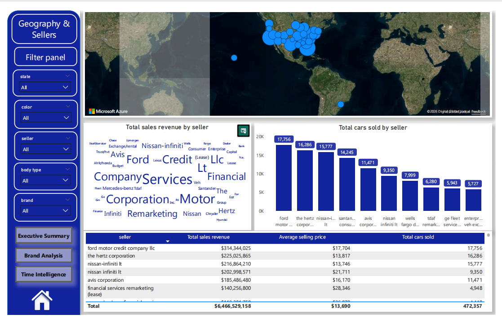
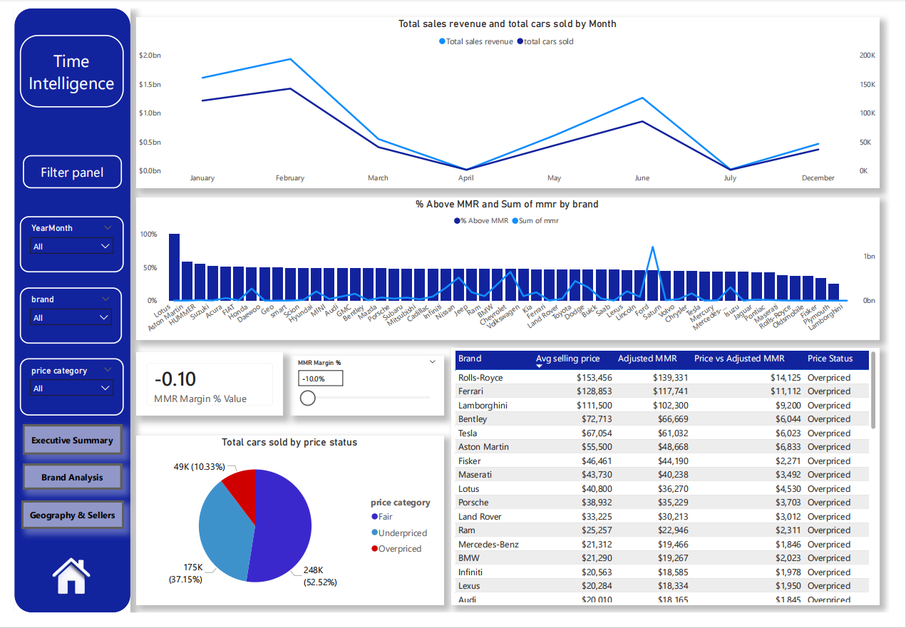

# Car Sales Performance & Market Intelligence Dashboard

## Business Problem
The automotive market generates large volumes of sales data, but raw data alone does not support pricing strategy,
seller performance evaluation, or market trend analysis. This project aims to analyze vehicle sales data to identify
revenue drivers, pricing efficiency, seller behavior, and time-based sales patterns to support data-driven
business decisions.

## Dataset
- Source: Kaggle (Used Car Sales Dataset)
- Records: 472,000+ vehicle sales
- Key fields: brand, model, selling price, MMR price, seller, body type, sale date, location

## Tools & Technologies
- Python (Pandas, NumPy)
- SQL
- Power BI

## Data Processing (ETL)
- Extracted raw sales data from CSV format
- Cleaned missing values, standardized price fields, and corrected data types using Python
- Engineered pricing features such as price difference vs MMR
- Modeled data in Power BI using a star schema for efficient analysis

## Key Insights
- SUVs and sedans generated the highest total revenue across all vehicle categories
- Over 20% of vehicles were priced above market reference (MMR), indicating potential pricing risk
- Sales volume showed clear seasonal patterns with peaks during specific months
- Certain sellers consistently outperformed others in revenue and pricing efficiency

## Business Insights & Recommendations
- Identified that SUVs and sedans contributed the majority of total revenue, suggesting inventory prioritization in these segments.
- Found that approximately 20%+ of vehicles were priced above MMR, indicating potential overpricing risk and slower sales turnover.
- Seasonal analysis showed higher sales volumes during mid-year and year-end periods, supporting targeted promotional strategies.
- Certain sellers consistently outperformed others in both revenue and pricing efficiency, highlighting best-practice pricing models.
- Price vs MMR analysis can be used to flag high-risk listings and support dynamic pricing decisions.

## Dashboard Overview
The Power BI dashboard includes:

### Executive Summary

### Brand & Category Analysis

### Pricing Intelligence

### Time-Based Sales Trends

## Outcome & Business Value
This analysis enables businesses to evaluate pricing strategies, identify high-performing sellers,
optimize inventory decisions, and improve revenue forecasting using historical sales trends.
